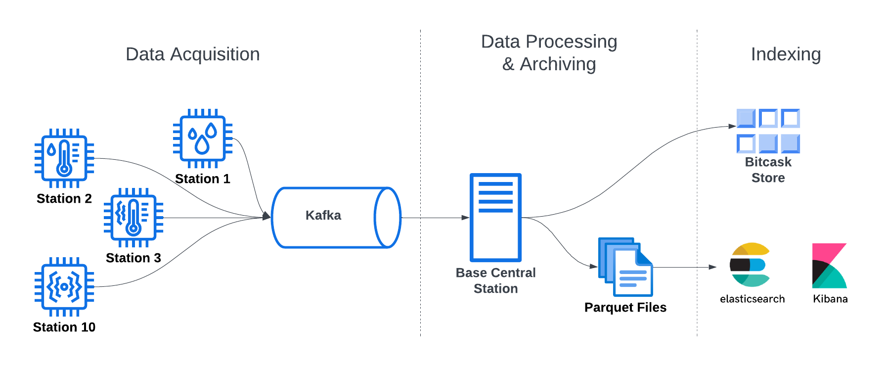

# Weather Monitoring System
## Overview
This project aims to design and implement a scalable and efficient IoT-based weather monitoring system. The system collects weather data from multiple distributed weather stations, processes the data in real-time, and stores it for further analysis and visualization.

## System Architecture
### Data Acquisition
- **Weather Stations**: Multiple weather stations are deployed in various locations.
- **Sensors**: Each weather station is equipped with sensors to measure weather parameters such as temperature, humidity, pressure, etc.
- **Data Transmission**: Weather stations transmit their readings to a queuing service (Kafka) in real-time.

### Data Processing & Archiving
- **Central Base Station**: Responsible for consuming the streamed data from Kafka.
- **Data Processing**: Processes the incoming data streams in real-time.
- **Archiving**: Archives all data in the form of Parquet files for long-term storage and analysis.

### Indexing
- **Key-Value Store (Bitcask)**: Maintains the latest reading from each individual weather station for quick access and retrieval.
- **Elasticsearch / Kibana**: Provides indexing and search capabilities for historical data analysis and visualization.

## Cluster Setup

- **Weather Stations (10)**: Collect weather data (temperature, humidity, etc.) and transmit it to the Kafka server.
- **Kafka Service (1)**: Apache Kafka acts as a high-throughput, distributed streaming platform. Weather stations publish weather data streams to Kafka topics, decoupling data producers (weather stations) from consumers (Central Station).
- **Central Station Service (1)**: Acts as the central hub for receiving weather data. Responsible for processing, archiving, and routing the data.
- **Rain Trigger Kafka Processor Service (1)**: Analyzes the data stream in real-time, focusing on rain-related metrics to detect when it's raining.
- **Elasticsearch Service (1)**: Acts as a search and analytics engine for large volumes of data. Processed weather data streams are ingested into Elasticsearch for storage and further analysis.
- **Kibana Service (1)**: Provides a user interface for visualizing the data stored in Elasticsearch. Users can explore weather trends, generate reports, and gain insights from collected data.

## Weather Station
### Weather Station Mock
A weather station mock simulates real stations sending data every second to report its sampled weather status.

### Weather Station API
The system integrates with Open-Meteo (https://open-meteo.com/), a free and open-source weather API, to obtain real-time weather data. The retrieved data is formatted into a standardized message structure and published to the Kafka message queue for further processing.

## Central Station
The central station service continuously consumes the real-time stream of weather data from weather stations. This incoming data undergoes a transformation process to ensure compatibility with BitCask Riak before inserting it to maintain an updated store of each station status.

For long-term storage, the data is archived into Parquet files, partitioned by time and station ID. These Parquet files are then loaded into Elasticsearch for visualization and analysis with Kibana.

## BitCask Riak
### Main Functionalities:
- **Open**: Opens the database directory for read/write operations.
- **Get**: Retrieves the value associated with a given key.
- **Put**: Inserts or updates a key-value pair in the database.
- **Compact**: Performs a merge and compaction operation to reclaim space and optimize performance.

## ElasticSearch / Kibana
All weather statuses are indexed in Elasticsearch, enabling fast retrieval and exploration through Kibana's user-friendly interface.